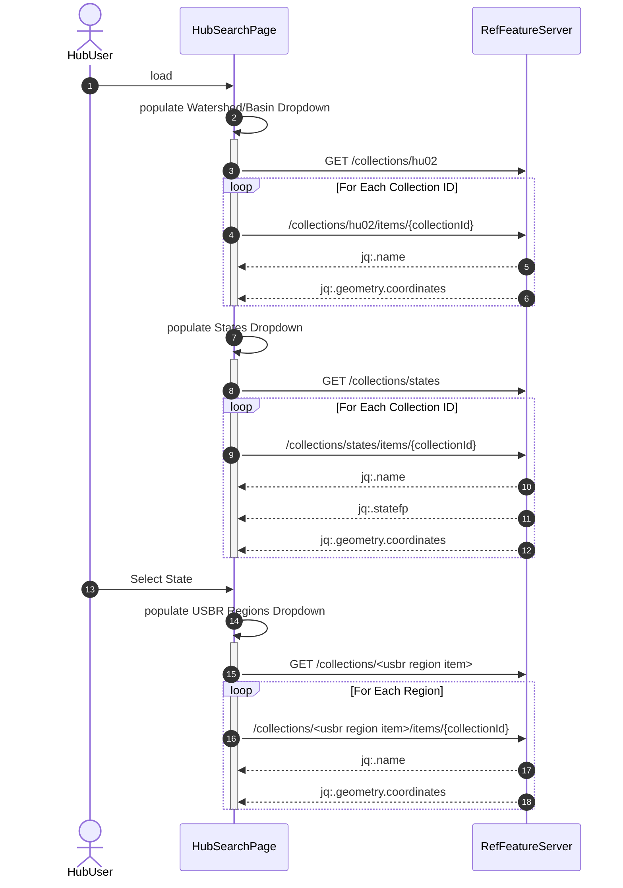
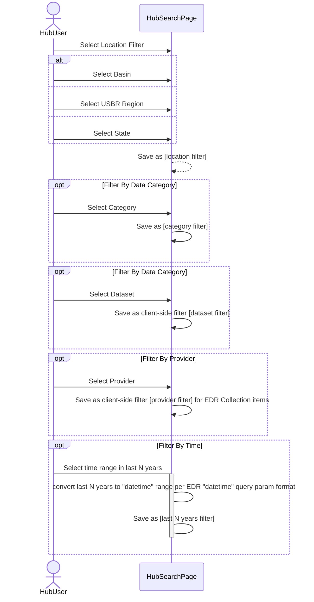
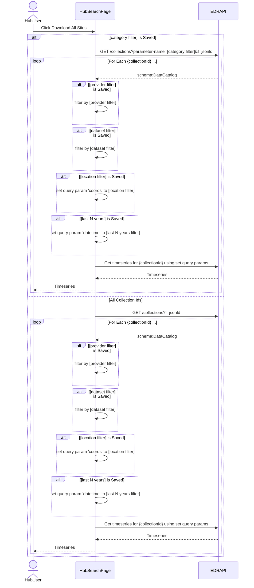

# Problem

The Western Water Data Hub [search interface](https://doimspp.sharepoint.com/:b:/r/sites/bor-lincoln-wswc-interop-water-data-hub/Shared%20Documents/General/Visualization%20Tool/National%20Data%20Explorer%20update_10_15_2024.pdf?csf=1&web=1&e=BHU9JD) is designed to search across supported data sources using the EDR API. The proposed search categories and filters are outlined below

# Hub Search Filters

> Note: The following sections make use of the URI schema `jq:` which is intended to show the reader the intended JSON path the the referenced element value within a JSON-LD document if the [jq](https://jqlang.org/) utility was used.  For instance `jq:.geometry.coordinates` references a JSON(-LD) document with the nested property geometry -> coordinates like `{ "geometry":{"coordinates":  <some value>}}` where `<some value>` is the referenced value returned from the `jq` filter `.geometry.coordinates`.

## Filter by Location

Location filters are segmented into (HUC02) Watersheds, States, and Counties. 

> Should we have Reclamation Regions as well?

### Filter by Watershed

Watershed contains a list of HUC02 watersheds that intersect with one or more of the 17 western states within the Bureau of Reclamation (Reclamation) jusrisdiction. Names and  geographic boundaries for these watersheds can be found in the Geoconnex reference feature server [here](https://reference.geoconnex.us/collections/hu02) as  collection item listings by fetching  each collection item resource as a JSON-LD document  `?f=jsonld` and extracting the name `jq:.name` and  (MultiPolydon) coordinates for the watershed  `jq:.geometry.coordinates`.

> Note: need a way to filter all watersheds to only the ones that intersect with the Reclamation regions?

### States

List of [17 western states](https://www.usbr.gov/main/images/region-map-small.jpg) which are under Reclamation's jurisdiction. Geographic boundaries can be found in the Geoconnex reference feature server [here](https://reference.geoconnex.us/collections/states/). Iterating each collection item and fetching its JSON-LD representation `?f=jsonld` will provide the state code `jq:.stusps`, state name `jq:.name`, and (MultiPolygon) coordinates `jq:geometry.coordinates`. 

## Filter by Data Category

### Category

I believe `Category` as shown in the search interface is synonymous with USBR RISE system's `Parameter Group` term. In this context, a canonical Parameter Group designation **COULD BE** be fetched from the JSONLD representation of the `/collections` resource similar to each collection item having a `parameter_names` property in the JSON document representation of the collection item. This collection level list of the canonical  parameter names would be the Data Category/Parameter Group variables that are sourced from the USBR ontology. 

> Need to investigate the feasibility of exposing the parameter group names in `/collections` json(-ld) resource to be able to populate this list and still remain conformant to EDR (I hope)

> Should we change the terminology here? `Parameter Group` is what is familiar to RISE users for instance. 

### Dataset

I believe `Dataset` here is synonymous with USBR RISE system's `Parameter` term. The population of this listing is dependent upon the selection of a `Category` (Parameter Group) filter where parameters are Objects of SKOS `narrower`

## Filter by Provider 

### Provider 

Provider is thought to be the publishing organization of the dataset. This listing could be populated by iterating the EDR `/collections` item links as JSON-LD document resources  `?f=jsonld` where the provider name is  `jq:.provider.name`. The filtering process would be filtering collection items by the user selected provider names. 

> Note: currently all the EDR collection item JSON-LD resource documents  set the provider organization to the `Internet of Water`. This should be changed to the organization that publishes the data (e.g. USGS, Reclamation, etc...) and its related metadata. 

## Time 

Time is the number of years (from present day) that have a period of record.

The JSON-LD representation for each collection item allow for the specification of a period of record `jq:.dataset.temporalCoverage` (see [schema.org here](https://schema.org/temporalCoverage) for details on temporalCoverage format). 

> Currently the value `jq:.dataset.temporalCoverage` is set to null for all collection items. Need to be able to determine the period of record from the source and set this value accordingly so that it can be used by clients to filter by period of record. 

> What isn't clear here is what constitutes a valid period year. For instance, if one time series data point exists for a year is does that count as a year within the period of record? 

# Sequence Diagrams

## Load Location Filters

## Select  Filters

## Download All Sites 

